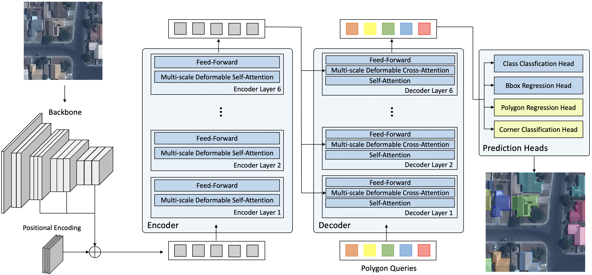

# PolyBuilding

## Introduction

我们介绍了一种名为PolyBuilding的矢量目标Transformer，用于建筑物提取。PolyBuilding直接从遥感图像中预测建筑物的矢量表示。它基于encoder-decoder Transformer架构，同时预测建筑实例的边界框和多边形。给定一组多边形查询，模型学习它们之间的关系并从图像中编码上下文信息，以预测具有固定顶点数的最终建筑物多边形集。考虑到预测固定数量的顶点会导致顶点冗余和减少多边形的规则性，我们设计了一个角点分类头来区分建筑物的角落。通过利用角点分类分数，设计了一个多边形细化方案，以消除冗余顶点，并产生具有规则轮廓和低复杂度的最终多边形。此外，虽然PolyBuilding模型完全可端到端地训练，我们也提出了一种两阶段训练策略，将坐标回归和角分类分解为两个阶段，以减轻多任务学习的困难。PolyBuilding在像素级覆盖率、实例级检测性能和几何级属性方面实现了新的SOTA水平。

### ENG Version

We present PolyBuilding, a polygon Transformer for building extraction. PolyBuilding direct predicts vector representation of buildings from remote sensing images. It builds upon an encoder-decoder transformer architecture and simultaneously predicts the bounding boxes and polygons for the building instances. Given a set of polygon queries, the model learns the relations among them and encodes context information from the image to predict the final set of building polygons with a fixed vertex number. Considering that predicting a fixed number of vertices would cause vertex redundancy and reduce polygon regularity, we design a corner classification head to distinguish the building corners. By taking advantage of the corner classification scores, a polygon refinement scheme is designed to remove the redundant vertices and produce the final polygons with regular contours and low complexity. In addition, although the PolyBuilding model is fully end-to-end trainable, we propose a two-phase training strategy to decompose the coordinate regression and corner classification into two stages to alleviate the difficulty of multi-task learning. PolyBuilding achieves a new state-of-the-art in terms of pixel-level coverage, instance-level detection performance, and geometry-level properties. Quantitative and qualitative results verify the superiority and effectiveness of our model.

  

## Usage
默认配置default.py可以用于从头训练一个矢量建筑物提取的模型。我们已经提供了一个训练好的默认模型（基于AICrowdDataset完成训练）：`aie://PolyBuilding/polybuilding.pth`。如果你有更进一步的需求，比如继续在你自己的数据集上进行模型微调，可以把我们提供的模型配置到load_from参数。
